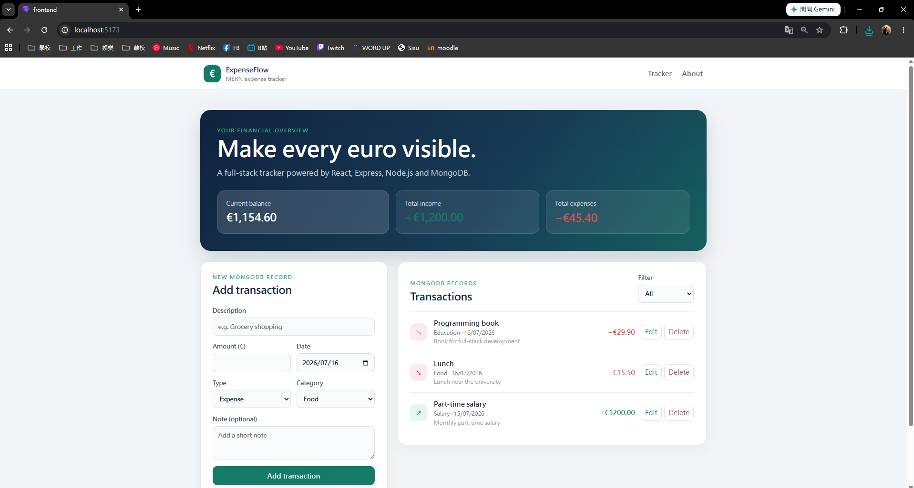

# Personal Expense Tracker — MERN Stack



A full-stack personal finance application created for **CT70A9140 Software Development Skills: Full-Stack 2025-26**. The application allows users to create, view, edit, delete and filter income and expense records. Financial totals update automatically, and every transaction is stored persistently in MongoDB.

## Student Information

- **Student:** Yu-Chi Huang
- **Student number:** 3775879
- **Course:** CT70A9140 Software Development Skills: Full-Stack 2025-26

## Main Features

- Create income and expense transactions
- Display transactions stored in MongoDB
- Edit existing transactions
- Permanently delete transactions
- Filter records by income or expense
- Calculate total income, total expenses and current balance
- Validate data in both the React form and Express API
- Display loading, success and error states
- Navigate between Tracker and About pages with React Router
- Responsive layout for desktop and smaller screens

## MERN Architecture

```text
React frontend (port 5173)
        │ HTTP / JSON
        ▼
Express + Node.js API (port 5000)
        │ Mongoose
        ▼
MongoDB (port 27017)
```

## Technologies

### Frontend

- React 19
- Vite 8
- React Router
- JavaScript and CSS
- Fetch API

### Backend

- Node.js
- Express 5
- Mongoose 9
- express-validator
- CORS
- dotenv
- Nodemon

### Database and development tools

- MongoDB Community Server
- MongoDB Compass
- Git and GitHub
- Visual Studio Code

## Repository Structure

```text
fullstack-expense-tracker/
├── Coursework/
│   ├── NodeJS/
│   ├── MongoDB/
│   ├── ExpressJS/
│   └── React/
├── Evidence/
│   ├── 01_Environment_and_Git/
│   ├── 02_NodeJS/
│   ├── 03_MongoDB/
│   ├── 04_ExpressJS/
│   ├── 05_React/
│   └── 06_MERN_Project/
├── Project/
│   ├── backend/
│   │   ├── config/
│   │   ├── controllers/
│   │   ├── middleware/
│   │   ├── models/
│   │   ├── routes/
│   │   ├── .env.example
│   │   └── server.js
│   └── frontend/
│       ├── src/
│       │   ├── api/
│       │   └── components/
│       └── .env.example
├── Learning_Diary.md
├── PROJECT_REPORT.md
├── VIDEO_LINK.md
└── README.md
```

## Requirements

Install the following before running the project:

- Node.js 20 or newer
- npm
- MongoDB Community Server
- Git

MongoDB must be running locally as a Windows Service or through another local MongoDB process.

## Installation

### 1. Clone the repository

```bash
git clone https://github.com/oldcat20010116/fullstack-expense-tracker.git
cd fullstack-expense-tracker
```

### 2. Configure and install the backend

```bash
cd Project/backend
npm install
```

Copy `.env.example` to `.env`.

PowerShell:

```powershell
Copy-Item .env.example .env
```

Windows Command Prompt:

```bat
copy .env.example .env
```

The local configuration is:

```env
PORT=5000
MONGO_URI=mongodb://127.0.0.1:27017/expense_tracker_project
CLIENT_URL=http://localhost:5173
```

Start the backend:

```bash
npm run dev
```

Test the API health endpoint:

```text
http://localhost:5000/api/health
```

### 3. Configure and install the frontend

Open a second terminal:

```bash
cd Project/frontend
npm install
```

Copy `.env.example` to `.env`. It should contain:

```env
VITE_API_URL=http://localhost:5000/api
```

Start the frontend:

```bash
npm run dev
```

Open:

```text
http://localhost:5173
```

## API Endpoints

| Method | Endpoint | Purpose |
|---|---|---|
| GET | `/api/health` | Verify the backend is running |
| GET | `/api/transactions` | List all transactions |
| GET | `/api/transactions?type=expense` | Filter transactions by type |
| GET | `/api/transactions/:id` | Get one transaction |
| POST | `/api/transactions` | Create a transaction |
| PUT | `/api/transactions/:id` | Update a transaction |
| DELETE | `/api/transactions/:id` | Delete a transaction |

## Example Transaction

```json
{
  "description": "Grocery shopping",
  "amount": 45,
  "type": "expense",
  "category": "Food",
  "date": "2026-07-16",
  "note": "Weekly groceries and household supplies"
}
```

## Testing and Production Build

Run the frontend code-quality check:

```bash
cd Project/frontend
npm run lint
```

Create a production build:

```bash
npm run build
```

The application was manually tested for:

- MongoDB connection and persistent storage
- GET, POST, PUT and DELETE operations
- API and Mongoose validation
- React form validation
- Financial summary calculations
- Filtering and routing
- Success, loading, 404 and validation messages
- Production build completion

## Coursework

The `Coursework` directory contains separate exercises completed for Node.js, MongoDB, Express.js and React. Screenshots in `Evidence` document the environment setup, commands, API responses, database records and application behaviour.

## Documentation

- [Learning Diary](Learning_Diary.md)
- [Project Report](PROJECT_REPORT.md)
- [Demonstration Video](VIDEO_LINK.md)

## Author

Yu-Chi Huang — Student number 3775879

